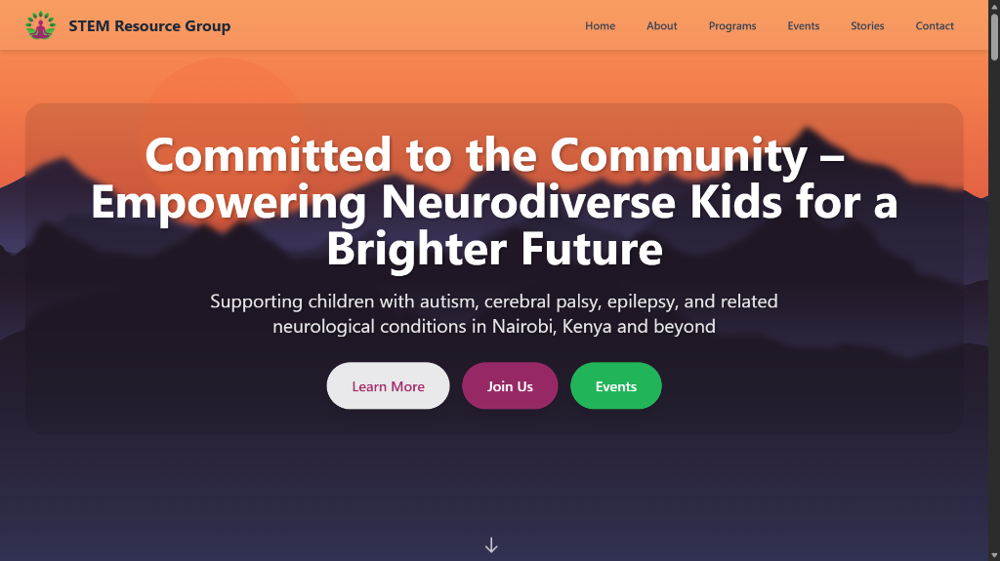

# STEM Resource Group (SRG) Website



<div align="center">
  <a href="https://stemresourcegroup.org/">
    <button style="background-color: #a32b6b; color: white; padding: 12px 24px; border: none; border-radius: 50px; font-size: 16px; font-weight: bold; cursor: pointer; box-shadow: 0 4px 6px rgba(0,0,0,0.1);">
      View Live Demo
    </button>
  </a>
</div>

<br>

## About

**STEM Resource Group (SRG)** is dedicated to empowering neurodiverse children and their families. This website serves as a hub for their programs, events, stories, and resources, supporting children with autism, cerebral palsy, epilepsy, and related neurological conditions in Nairobi, Kenya, and beyond.

## Tech Stack

This project is built with a focus on performance and simplicity, using modern web technologies:

-   **HTML5**: Semantic markup for structure and accessibility.
-   **Tailwind CSS**: Utility-first CSS framework for rapid and responsive styling (loaded via CDN).
-   **Vanilla JavaScript**: Lightweight logic for interactivity (mobile menu, carousels, modals).
-   **Flowbite**: Component library built on top of Tailwind CSS (used for some UI elements).

## Project Structure

The codebase is organized as follows:

-   `index.html`: The main entry point of the website.
-   `css/`: Contains custom stylesheets (e.g., `styles.css`) that override or extend Tailwind defaults.
-   `js/`: Contains JavaScript files for functionality:
    -   `main.js`: General site logic.
    -   `nav.js`: Navigation bar behavior (mobile toggle, scroll effects).
-   `images/`: Stores static assets like logos, background images, and the README header.
-   `netlify/`: Configuration for Netlify deployment.

## Setup & Development

To run this project locally:

1.  **Clone the repository** (if applicable) or download the source code.
2.  **Open the project folder** in your code editor (e.g., VS Code).
3.  **Serve the files**:
    -   You can use the **Live Server** extension in VS Code.
    -   Or run a simple Python HTTP server:
        ```bash
        python -m http.server 8000
        ```
    -   Or use `npx serve`:
        ```bash
        npx serve .
        ```
4.  **View in Browser**: Open `http://localhost:8000` (or the port provided by your server).

> [!NOTE]
> You can also view the live production version by clicking the **View Live Demo** button at the top of this README.

## Deployment

This site is configured for deployment on **Netlify**.
-   The `netlify.toml` file contains the build settings and publish directory configuration.
-   Pushing changes to the main branch will trigger an automatic deployment if connected to a Netlify site.
